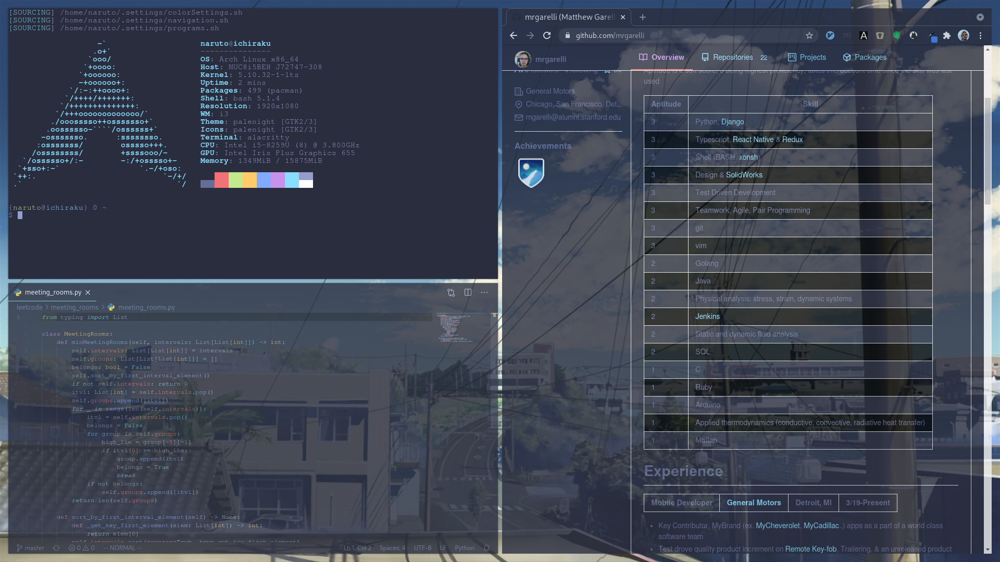

# System Git Configuration

### Pulling Unix files (for mac or linux), onto your machine

> cd "${HOME}"

> alias cfg='/usr/bin/git --git-dir=$HOME/.unx/ --work-tree=$HOME'

> git clone --bare 'https://github.com/mrgarelli/unix.git' $HOME/.unx

> cfg checkout

* may need to fix conflicts by moving files, then re-run previous command

> cfg config --local status.showUntrackedFiles no

* [In-depth Guide to tracking dotfiles](https://developer.atlassian.com/blog/2016/02/best-way-to-store-dotfiles-git-bare-repo/)

# Recommended installations and symbolic links
* [google chrome](https://aur.archlinux.org/packages/google-chrome/)
* [gtk palenight](https://aur.archlinux.org/packages/palenight-gtk-theme/)
* [pcmanfm](https://archlinux.org/packages/community/x86_64/pcmanfm/) -> files
* [vim-plug](https://aur.archlinux.org/packages/vim-plug/)
* [pavucontrol](https://archlinux.org/packages/extra/x86_64/pavucontrol/) -> sound
* [lazy git](https://archlinux.org/packages/community/x86_64/lazygit/)
* [zsh system clipboard](https://github.com/kutsan/zsh-system-clipboard)
	> cfg submodule add https://github.com/kutsan/zsh-system-clipboard $HOME/.settings/system-clipboard
