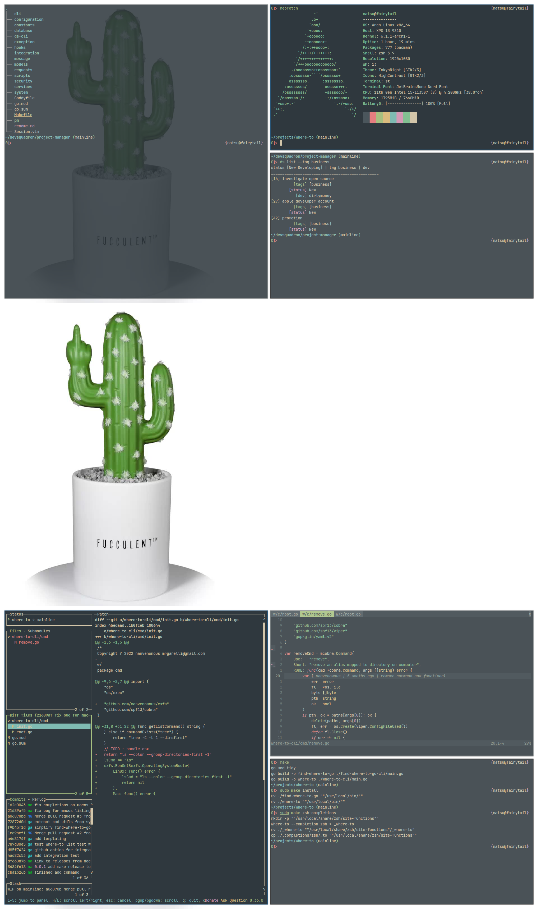

# Fucculent Dotfiles!

#### A rice dedicated to my favorite desk ornament, [the fucculent](https://www.fucculent.com/)



### Pulling Unix files (for mac or linux), onto your machine

```
cd "${HOME}"

alias cg="git --git-dir=${HOME}/.unx/ --work-tree=${HOME}"

git clone --bare 'https://github.com/nanvenomous/unix.git' "${HOME}/.unx"

cg checkout

# may need to fix conflicts by moving files, then re-run previous command

cg config --local status.showUntrackedFiles no

cg checkout fucculent
```

you can then optionally add a permanent alias to your login script
```
# ~/.bashrc, ~/.zshrc, ~/.xonshrc, ...
alias cg="git --work-tree=${HOME} --git-dir=${HOME}/.unx"
```

# Finally

Here's a picture of my full setup (for inspiration)! Forgive the poor photographic skills :)


* [In-depth Guide to tracking dotfiles](https://developer.atlassian.com/blog/2016/02/best-way-to-store-dotfiles-git-bare-repo/)

# To Automate
* [ ] [lazy git](https://archlinux.org/packages/community/x86_64/lazygit/)
* [ ] [everforest gtk](https://github.com/Fausto-Korpsvart/Everforest-GTK-Theme)
* [ ] [zsh system clipboard](https://github.com/kutsan/zsh-system-clipboard)
* [ ] [st](https://github.com/siduck76/st)
  * [nerdfonts](https://aur.archlinux.org/packages/nerd-fonts-jetbrains-mono/)
* [ ] firefox 
  * [firefox markdown](https://github.com/KeithLRobertson/markdown-viewer#support-for-local-files-on-linux)
  * `browser.fullscreen.autohide`
  * [ ] firefox shortcuts
```
map tj nextTab
map tk previousTab
map tn removeTab
map to createTab
map th moveTabLeft
map tl moveTabRight
map tp openCopiedUrlInNewTab

map gb goBack
map gj scrollPageDown
map gk scrollPageUp

map u restoreTab
```
