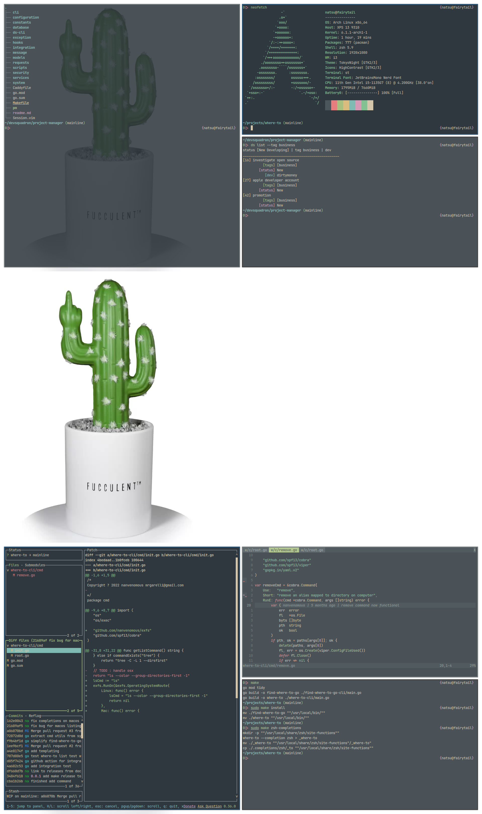

# System Git Configuration



### Pulling Unix files (for mac or linux), onto your machine

```bash
cd "${HOME}"

alias cg="git --git-dir=${HOME}/.unx/ --work-tree=${HOME}"

git clone --bare 'https://github.com/nanvenomous/unix.git' "${HOME}/.unx"

cg checkout

# may need to fix conflicts by moving files, then re-run previous command

cg config --local status.showUntrackedFiles no
```

then you can make nushell your shell of choice:
```bash
touch "${HOME}/.config/nushell/local.nu"
chsh -s /usr/bin/nu
```

- [In-depth Guide to tracking dotfiles](https://developer.atlassian.com/blog/2016/02/best-way-to-store-dotfiles-git-bare-repo/)

# To Automate

- [ ] [pcmanfm](https://archlinux.org/packages/community/x86_64/pcmanfm/) -> files
- [ ] [pavucontrol](https://archlinux.org/packages/extra/x86_64/pavucontrol/) -> sound
- [ ] [dns with systemd-resolvd](https://wiki.archlinux.org/title/NetworkManager#systemd-resolved)
- [ ] [AMDGPU](https://wiki.archlinux.org/title/AMDGPU)
- [ ] firefox
  - [firefox markdown](https://github.com/KeithLRobertson/markdown-viewer#support-for-local-files-on-linux)
  - nav to [configuration page](about:config) `browser.fullscreen.autohide`
  - [ ] firefox shortcuts

```
map tj nextTab
map tk previousTab
map tn removeTab
map to createTab
map th moveTabLeft
map tl moveTabRight
map tp openCopiedUrlInNewTab

map gb goBack
map gj scrollPageDown
map gk scrollPageUp

map u restoreTab
```
