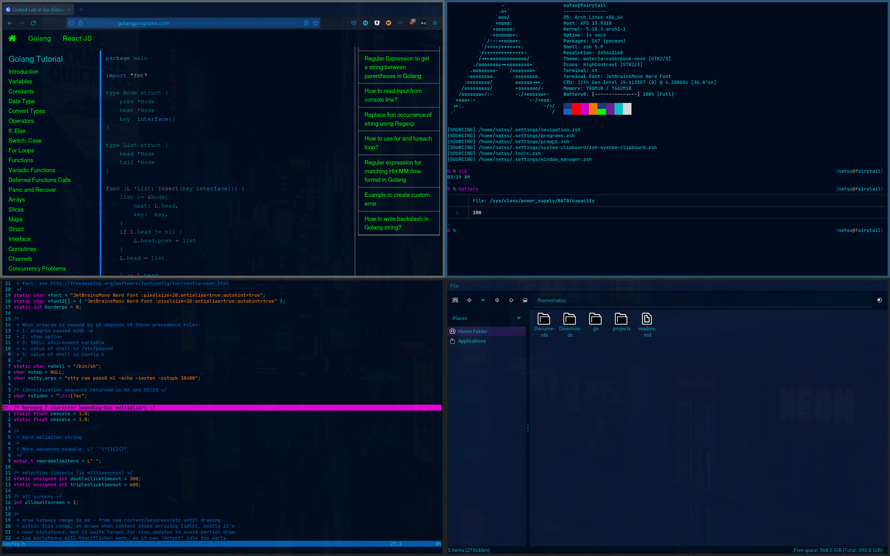

# System Git Configuration



### Pulling Unix files (for mac or linux), onto your machine

> cd "${HOME}"

> alias cg="git --git-dir=${HOME}/.unx/ --work-tree=${HOME}"

> git clone --bare 'https://github.com/nanvenomous/unix.git' "${HOME}/.unx"

> cg checkout

* may need to fix conflicts by moving files, then re-run previous command

> cg config --local status.showUntrackedFiles no

you can then optionally add a permanent alias to your login script
```
# ~/.bashrc, ~/.zshrc, ~/.xonshrc, ...
alias cg="git --work-tree=${HOME} --git-dir=${HOME}/.unx"
```


* [In-depth Guide to tracking dotfiles](https://developer.atlassian.com/blog/2016/02/best-way-to-store-dotfiles-git-bare-repo/)

# To Automate
* [ ] [google chrome](https://aur.archlinux.org/packages/google-chrome/)
* [ ] [gtk tokyo night](https://github.com/stronk-dev/Tokyo-Night-Linux)
* [ ] [pcmanfm](https://archlinux.org/packages/community/x86_64/pcmanfm/) -> files
* [ ] [vim-plug](https://aur.archlinux.org/packages/vim-plug/)
* [ ] [pavucontrol](https://archlinux.org/packages/extra/x86_64/pavucontrol/) -> sound
* [ ] [lazy git](https://archlinux.org/packages/community/x86_64/lazygit/)
* [ ] [zsh system clipboard](https://github.com/kutsan/zsh-system-clipboard)
* [ ] [st](https://github.com/siduck76/st)
  * [nerdfonts](https://aur.archlinux.org/packages/nerd-fonts-jetbrains-mono/)
* [ ] [dns with systemd-resolvd](https://wiki.archlinux.org/title/NetworkManager#systemd-resolved)
* [ ] firefox 
  * [firefox markdown](https://github.com/KeithLRobertson/markdown-viewer#support-for-local-files-on-linux)
  * `browser.fullscreen.autohide`
  * [ ] firefox shortcuts
```
map tj nextTab
map tk previousTab
map tn removeTab
map to createTab
map th moveTabLeft
map tl moveTabRight
map tp openCopiedUrlInNewTab

map gb goBack
map gj scrollPageDown
map gk scrollPageUp

map u restoreTab
```
